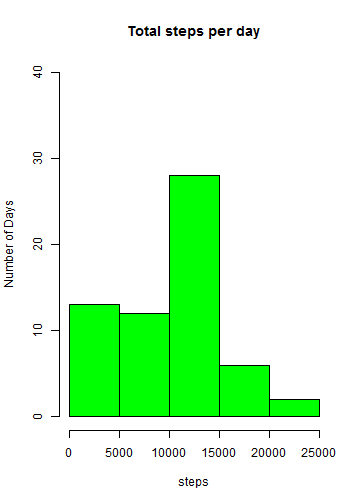
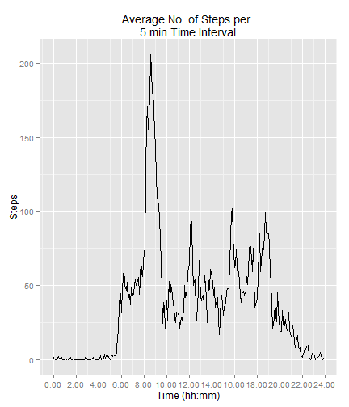
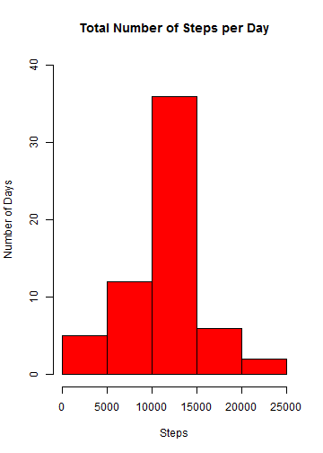
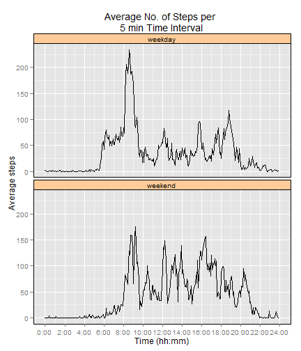

---  
title: "Reproducible Research: Peer Assignment-1"
author: "Jagan Narayanam"
date: "Friday, December 12, 2014"
output:
  html_document:
    keep_md: yes
---  

---
## Reproducible Research: Peer Assignment-1  
***by Jagan Narayanam***  
*Friday, December 12, 2014*  

---

### Loading and Processing the Data:  
        1. Download the data set into the working directory  
        2. Read the file using read.csv function  
        3. Convert the "date" (a character variable) into "Date" variable  


```r
url <- "http://d396qusza40orc.cloudfront.net/repdata%2Fdata%2Factivity.zip"
download.file(url, destfile = "repdata_data_activity.zip", mode = "wb")
unzip("repdata_data_activity.zip")
activity <- read.csv("activity.csv", header = TRUE)
activity$date <- as.Date(as.character(activity$date), "%Y-%m-%d")
```

### Conversion of "interval" variable into a continuous minutes variable  
        1. Load the dplyr package library  
        2. Divide the "interval" by 100 and assign to a new varible "time"    
        3. Truncate the "time" variable and assign to a new variable "hours"  
        4. Subtraction of "hours" from "time" followed by multiplication with 100 and assign to "mins" variable  
        5. Finally mutate the "interval" by hours*60+mins  
        6. Subset the activity to eliminate the "hours", "mins", and "time"  
        

```r
library(dplyr)
activity <- activity %>%
        mutate(time = interval/100) %>%
        mutate(hours = trunc(time)) %>%
        mutate(mins = 100*(time-hours)) %>%
        mutate(interval = hours*60+mins)
activity <- activity[, 1:3]
```
#### Function to convert "interval" variable to "HM" format  
        1. HM formatting is important to label the axis in a readable format


```r
HM <- function(x) {
        h <- floor(x/60)
        m <- floor(x %% 60)
        lab <- sprintf("%02d:%02d", h, m)
        lab <- gsub("^0", "", lab)
}
```


### What is mean total number of steps taken per day?    

        1. Make a histogram of the total number of steps taken each day    
        2. Calculate and report the mean and median total number of steps taken per day  
           
**Approach:**  
        1. load the dplyr package library  
        2. group the data by date and summarize the sum of the steps per day  
        3. plot the histogram  
        4. calculate mean and median  


```r
library(dplyr)
activity$date <- as.Date(as.character(activity$date), "%Y-%m-%d")
total_steps_day <- activity %>%        
        group_by(date) %>%      
        summarize(total = sum(steps, na.rm = TRUE))
hist(total_steps_day$total, ylab = "Number of Days", xlab = "steps",      
     main = "Total steps per day", col = "green", ylim = c(0, 40))
```

 

```r
mean <- mean(total_steps_day$total)
median <- median(total_steps_day$total)
```

The **mean** for the total number of steps taken per day is  
9354.2295082  

The **median** for the total number of steps taken per day is  
10395    

  
### What is the average daily activity pattern?  

    1. Make a time series plot (i.e. type = "l") of the 5-minute interval (x-axis)  
    and the average number of steps taken, averaged across all days (y-axis)  

    2. Which 5-minute interval, on average across all the days in the dataset,  
    contains the maximum number of steps?  

**Approach:**  
        1. group the data by interval and summarize the mean of the steps per interval  
        2. load the ggplot2 package library  
        3. plot using the ggplot function  
        4. calculate the interval that has maximum average number of steps  


```r
avg_steps_interval <- activity %>%
        group_by(interval) %>%
        summarize(average = mean(steps, na.rm = TRUE))
library(ggplot2)
plot2 <- ggplot(avg_steps_interval, aes(interval, average))
plot2 + geom_line() + xlab("Time (hh:mm)") + ylab("Steps") +
        ggtitle ("Average No. of Steps per \n5 min Time Interval") +
        scale_x_continuous(label = HM, breaks = seq(0, 1455, 120))
```

 

```r
max_interval <- HM(subset(avg_steps_interval, average == max(average))[[1, 1]])
```

The time interval that has the highest average number of steps is  
**8:35**  


### Imputing missing values**  

    1. Calculate and report the total number of missing values in the dataset (i.e. the total number of rows  
       with NAs)  
    2. Devise a strategy for filling in all of the missing values in the dataset. The strategy does not need  
       to be sophisticated. For example, you could use the mean/median for that day, or the mean for that  
       5-minute interval, etc.    
    3. Create a new dataset that is equal to the original dataset but with the missing data filled in.  
    4. Make a histogram of the total number of steps taken each day and  Calculate and report the mean and median
       total number of steps taken per day. Do these values differ from the estimates from the first part of the 
       assignment? What is the impact of imputing missing data on the estimates of the total daily number of steps?  


**Approach:**  
        1. Calculating the totla number of missing values  
        2. group the data by interval and mutate the mean of the steps per interval    
        3. subset the data that belongs to NAs.  
        4. Extract the means column from NAs data  
        5. substitute the NAs by mean of steps per interval to create a new data set   
        6. group the data by date and summarize the sum of the steps per day  
        7. plot the histogram for the total number of steps per day  
        8. calculate the mean and median for total number of steps per day  


```r
total_NAs <- sum(is.na(activity))
activity_interval <- activity %>%
        group_by(interval) %>%
        mutate(means = mean(steps, na.rm = TRUE))
na_activity <- activity_interval[is.na(activity), ]
na_means <- na_activity$means
activity1 <- activity
activity1[is.na(activity1)] <- na_means
Total_day <- activity1 %>%
        group_by(date) %>%
        summarize(total = sum(steps))
hist(Total_day$total, xlab = "Steps", ylab = "Number of Days", 
     main = "Total Number of Steps per Day", col = "red", ylim = c(0, 40))
```

 

```r
mean1 <- mean(Total_day$total)
median1 <- median(Total_day$total)
```

The total number of NAs are 2304  

The **mean** for the total number of steps taken per day  
without NA values = **9354.2295082**    
imputing NA values = **1.0766189 &times; 10<sup>4</sup>**    

The **median** for the total number of steps taken per day  
without NA values = **10395**    
imputing NA values = **1.0766189 &times; 10<sup>4</sup>**    

Imputing the NAs with the mean of steps per interval increased mean and median and evened the data in such a way that   
mean equals to median. This can be clearly visualised from histograms.  


### Are there differences in activity patterns between weekdays and weekends?  

**Approach:**  
        1. create a new variable "day" by converting the date variable to weekdays  
        2. substitute the weekdays Mon-Fri by "weekday" and Sat-Sun by "weekend"  
        3. convert the "day" a charater variable to a factor variable  
        4. group the data by day and interval and summarize the mean of the  
           steps per day and interval  
        5. plot the panel plot using ggplot function for the average number  
           of steps per per interval and per day("weekday", "weekend")  
        


```r
activity$date <- as.Date(as.character(activity$date), "%Y-%m-%d")
activity$day <- weekdays(activity$date)
activity$day <- gsub("Sunday|Saturday", "weekend", activity$day) 
activity$day <- gsub("Monday|Tuesday|Wednesday|Thursday|Friday", "weekday", activity$day)
activity$day <- as.factor(activity$day)
Avg_Steps_week <- activity %>%
        group_by(day, interval) %>%
        summarize(average = mean(steps, na.rm = TRUE))
library(ggplot2)
plot <- ggplot(data = Avg_Steps_week, aes(x= interval, y = average))
plot + facet_wrap(~day, ncol = 1) + geom_line() + 
        xlab ("Time (hh:mm)") + ylab ("Average steps") +
        ggtitle("Average No. of Steps per \n5 min Time Interval") +
        theme(strip.background = element_rect(colour = "black", fill = "#FFCC99")) +
        theme(panel.border = element_rect(colour = "black", fill = "NA")) +
        scale_x_continuous(label = HM, breaks = seq(0, 1455, 120))
```

 

